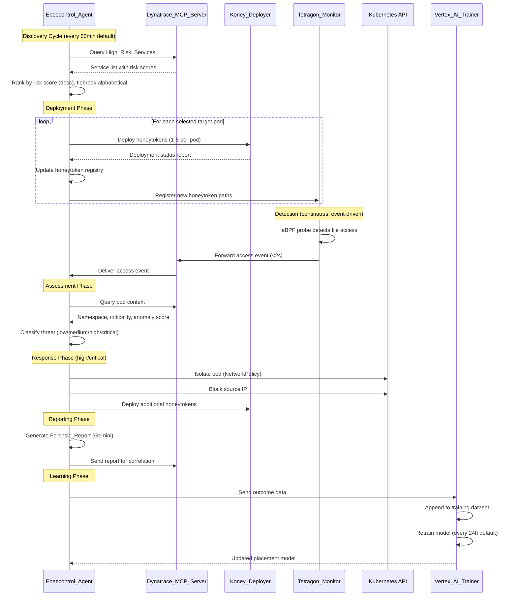

# Design Document: ebeecontrol

## Overview

ebeecontrol is an autonomous deception engine that orchestrates honeytoken deployment and monitoring in Kubernetes environments. The system uses a Gemini-powered agent (built with Google Cloud Agent Builder) as the central decision-making component, coordinating five subsystems: eBPF-based kernel monitoring (Tetragon), decoy deployment (Koney), observability context (Dynatrace MCP Server), adaptive learning (Vertex AI), and Dynatrace-native operational visibility (via Metrics API and Log Ingestion API).

The system operates in a continuous loop: discover high-risk services → deploy honeytokens → detect access → assess threat → respond → learn. All steps execute autonomously without human approval, with the Gemini agent making real-time decisions about placement strategy, threat classification, and response actions. The Ebeecontrol_Agent pushes custom metrics and structured logs to Dynatrace APIs, where a native Dynatrace Dashboard (composed of tiles and DQL queries) provides security operators with full visibility into system activity, threat detections, and response outcomes.

### Key Design Decisions

1. **Gemini as orchestrator**: The agent uses Gemini's reasoning capabilities to make nuanced threat classification and response decisions, rather than relying on static rule engines.
2. **eBPF for detection**: Tetragon provides kernel-level visibility that cannot be evaded by userspace techniques, ensuring no honeytoken access goes undetected.
3. **Dynatrace as context provider**: Leveraging existing observability infrastructure avoids duplicating topology discovery and anomaly detection.
4. **Vertex AI for continuous improvement**: The placement model improves over time based on real incident outcomes, reducing false positives and optimizing honeytoken placement.
5. **Event-driven + periodic architecture**: Detection is event-driven (immediate response), while discovery and learning are periodic (configurable intervals).
6. **Dynatrace-native dashboard**: Operational visibility is achieved by pushing metrics and logs to Dynatrace APIs (Metrics API for numeric state, Log Ingestion API for structured events). The dashboard is a Dynatrace Dashboard artifact using native tiles and DQL queries — no custom UI application is deployed or maintained.

## Architecture

### High-Level Architecture

```mermaid
graph TB
    subgraph "Control Plane"
        Agent[Ebeecontrol_Agent<br/>Gemini-powered Orchestrator]
        Registry[(Honeytoken Registry)]
        AuditLog[(Audit Log)]
        ReportStore[(Forensic Reports)]
    end

    subgraph "Dynatrace Platform"
        DtMetrics[Dynatrace_Metrics_API<br/>Custom Metrics Ingestion]
        DtLogs[Dynatrace_Log_Ingestion_API<br/>Structured Log Ingestion]
        DtDashboard[Operations_Dashboard<br/>Native Tiles + DQL Queries]
        Dynatrace[Dynatrace_MCP_Server<br/>Topology + Davis AI]
    end

    subgraph "Detection Layer"
        Tetragon[Tetragon_Monitor<br/>eBPF Kernel Probes]
        EventBuffer[(Local Event Buffer<br/>max 1000 events)]
    end

    subgraph "Deployment Layer"
        Koney[Koney_Deployer<br/>Decoy Injection]
    end

    subgraph "Learning Layer"
        VertexAI[Vertex_AI_Trainer<br/>Placement Model]
        TrainingData[(Training Dataset)]
    end

    subgraph "Kubernetes Cluster"
        Pods[Target Pods]
        NetPol[Network Policies]
        K8sAPI[Kubernetes API]
    end

    Agent -->|"Query High-Risk Services"| Dynatrace
    Agent -->|"Deploy Honeytokens"| Koney
    Agent -->|"Isolate Pods / Block IPs"| K8sAPI
    Agent -->|"Send Outcome Data"| VertexAI
    Agent -->|"Get Updated Model"| VertexAI
    Agent -->|"Query Pod Context"| Dynatrace
    Agent -->|"Send Forensic Reports"| Dynatrace

    Agent -->|"Push Metrics"| DtMetrics
    Agent -->|"Push Logs"| DtLogs

    DtMetrics -->|"Data Source"| DtDashboard
    DtLogs -->|"Data Source"| DtDashboard

    Tetragon -->|"Access Events"| Dynatrace
    Dynatrace -->|"Forward Events"| Agent

    Koney -->|"Inject Honeytokens"| Pods
    Tetragon -->|"Monitor File Access"| Pods
    K8sAPI -->|"Apply NetworkPolicy"| NetPol

    Agent --- Registry
    Agent --- AuditLog
    Agent --- ReportStore
    Tetragon --- EventBuffer
    VertexAI --- TrainingData
```



### Workflow Sequence



### Component Communication Patterns

| Source | Destination | Protocol | Timeout | Retry Strategy |
|--------|-------------|----------|---------|----------------|
| Agent → Dynatrace | REST/gRPC | 30s (discovery), 3s (context) | Exponential backoff, 5 retries |
| Agent → Koney | gRPC | 30s | Single retry with alternative pod |
| Agent → K8s API | REST (kubectl) | 10s | 3 retries, 5s interval |
| Agent → Vertex AI | REST | 60s | No retry (async) |
| Tetragon → Dynatrace | gRPC stream | 2s | 5 retries, 10s interval |
| Vertex → Agent | Pub/Sub or polling | N/A | Model published on success |
| Agent → Dynatrace Metrics API | REST (HTTPS) | 10s | Exponential backoff, 5 retries (2s, 4s, 8s, 16s, 32s) |
| Agent → Dynatrace Log Ingestion API | REST (HTTPS) | 10s | Exponential backoff, 5 retries (2s, 4s, 8s, 16s, 32s) |

## Components and Interfaces

### 1. Ebeecontrol_Agent

The central orchestrator built on Google Cloud Agent Builder with Gemini as the reasoning engine.

**Responsibilities:**
- Orchestrate the full workflow cycle
- Make threat classification decisions
- Initiate response actions
- Generate forensic reports
- Maintain honeytoken registry and audit log
- Consume updated placement models

**Interface:**

```typescript
interface EbeecontrolAgent {
  // Lifecycle
  start(): Promise<void>;
  stop(): Promise<void>;
  healthCheck(): Promise<HealthStatus>;

  // Discovery
  initiateDiscoveryCycle(): Promise<DiscoveryResult>;

  // Deployment
  deployHoneytokens(target: PlacementTarget): Promise<DeploymentResult>;

  // Assessment
  assessThreat(event: AccessEvent): Promise<ThreatAssessment>;

  // Response
  executeResponse(assessment: ThreatAssessment): Promise<ResponseResult>;

  // Reporting
  generateForensicReport(incident: IncidentData): Promise<ForensicReport>;

  // Learning
  submitOutcomeData(outcome: OutcomeData): Promise<void>;
  applyUpdatedModel(model: PlacementModel): Promise<void>;
}

interface HealthStatus {
  overall: "healthy" | "degraded" | "unhealthy";
  components: {
    tetragonMonitor: ComponentHealth;
    koneyDeployer: ComponentHealth;
    dynatraceMcpServer: ComponentHealth;
    vertexAiTrainer: ComponentHealth;
  };
  timestamp: string; // ISO 8601
}

interface ComponentHealth {
  status: "healthy" | "unhealthy";
  lastCheckTimestamp: string;
  lastErrorMessage?: string;
}
```

### 2. Tetragon_Monitor

eBPF-based kernel-level file access monitor.

**Responsibilities:**
- Attach eBPF probes to honeytoken file paths
- Generate access events with full process context
- Forward events to Dynatrace MCP Server
- Buffer events on delivery failure
- Detect newly registered honeytokens within 30s

**Interface:**

```typescript
interface TetragonMonitor {
  // Lifecycle
  start(): Promise<void>;
  stop(): Promise<void>;

  // Registration
  registerHoneytokenPath(path: HoneytokenPath): Promise<void>;
  unregisterHoneytokenPath(path: HoneytokenPath): Promise<void>;
  getRegisteredPaths(): Promise<HoneytokenPath[]>;

  // Monitoring
  getBufferStatus(): BufferStatus;
}

interface HoneytokenPath {
  podId: string;
  namespace: string;
  filePath: string;
  honeytokenId: string;
}

interface AccessEvent {
  eventId: string;
  processId: number;
  processBinaryPath: string;
  userId: number;
  podId: string;
  namespace: string;
  honeytokenPath: string;
  accessType: "open" | "read" | "write" | "stat";
  timestamp: string; // ISO 8601 with millisecond precision
}

interface BufferStatus {
  currentSize: number;
  maxCapacity: 1000;
  oldestEventTimestamp?: string;
  overflowCount: number;
}
```

### 3. Koney_Deployer

Decoy injection component for Kubernetes pods.

**Responsibilities:**
- Deploy honeytokens into target pods
- Support multiple honeytoken types
- Report deployment status
- Clean up partial deployments on failure
- Remove honeytokens when decommissioned

**Interface:**

```typescript
interface KoneyDeployer {
  // Deployment
  deploy(request: DeploymentRequest): Promise<DeploymentResponse>;
  undeploy(honeytokenId: string): Promise<void>;

  // Status
  getDeploymentStatus(honeytokenId: string): Promise<DeploymentStatus>;
}

interface DeploymentRequest {
  podId: string;
  namespace: string;
  honeytokens: HoneytokenSpec[];
}

interface HoneytokenSpec {
  type: "decoy_secret" | "decoy_file" | "decoy_credential";
  name: string;
  placement: string; // file path or secret name
  content?: string; // generated if not provided
}

interface DeploymentResponse {
  success: boolean;
  deployedHoneytokens: DeployedHoneytoken[];
  errors: DeploymentError[];
}

interface DeployedHoneytoken {
  honeytokenId: string;
  podId: string;
  namespace: string;
  type: "decoy_secret" | "decoy_file" | "decoy_credential";
  filePath: string;
  deploymentTimestamp: string; // ISO 8601
}

interface DeploymentError {
  podId: string;
  failureReason: string;
  remediationActions: ("retry_deployment" | "select_alternative_pod" | "escalate_to_operator")[];
}
```

### 4. Dynatrace_MCP_Server

Observability platform integration providing topology, context, and event routing.

**Responsibilities:**
- Provide high-risk service discovery data
- Provide pod contextual information for threat assessment
- Receive and route access events from Tetragon
- Receive forensic reports for correlation
- Provide Davis AI anomaly scores

**Interface:**

```typescript
interface DynatraceMcpServer {
  // Discovery
  queryHighRiskServices(): Promise<HighRiskService[]>;

  // Context
  getPodContext(podId: string, namespace: string): Promise<PodContext>;

  // Event routing
  onAccessEvent(callback: (event: AccessEvent) => void): void;

  // Reporting
  submitForensicReport(report: ForensicReport): Promise<void>;
}

interface HighRiskService {
  serviceId: string;
  serviceName: string;
  namespace: string;
  podIdentifiers: string[];
  riskScore: number; // 0-100
}

interface PodContext {
  namespace: string;
  namespaceClassification: "production" | "non-production";
  serviceCriticality: number; // 1-5
  davisAnomalyScore: number; // 0.0-1.0
  anomalyWindowMinutes: 10;
}
```

### 5. Vertex_AI_Trainer

Machine learning component for placement optimization.

**Responsibilities:**
- Ingest outcome data from incidents
- Maintain training dataset
- Retrain placement model on schedule
- Evaluate model against validation set
- Publish improved models only when accuracy improves

**Interface:**

```typescript
interface VertexAiTrainer {
  // Data ingestion
  ingestOutcomeData(data: OutcomeData): Promise<IngestionConfirmation>;

  // Model management
  getCurrentModelVersion(): Promise<ModelVersion>;
  getTrainingStatus(): Promise<TrainingStatus>;
}

interface OutcomeData {
  incidentId: string;
  accessEvent: AccessEvent;
  honeytokenType: "decoy_secret" | "decoy_file" | "decoy_credential";
  placementLocation: string;
  actionsTaken: ResponseAction[];
  effectiveness: {
    detectionToResponseLatencySeconds: number;
    threatContained: boolean;
    falsePositive: boolean;
  };
  timestamp: string;
}

interface IngestionConfirmation {
  datasetEntryCount: number;
  ingestionTimestamp: string;
}

interface ModelVersion {
  versionId: string;
  trainingDatasetSize: number;
  validationAccuracy: number; // percentage
  publishedTimestamp: string;
}

interface TrainingStatus {
  lastRetrainingTimestamp: string;
  nextScheduledRetraining: string;
  datasetSizeSinceLastTraining: number;
  minimumRecordsRequired: 50;
  retrainingIntervalHours: number; // 1-168, default 24
}
```

### 6. Dynatrace Data Ingestion

Component responsible for pushing operational metrics and structured logs from the Ebeecontrol_Agent to Dynatrace APIs, enabling the native Dynatrace Dashboard to visualize system state.

**Responsibilities:**
- Push honeytoken registry state as custom metrics to Dynatrace Metrics API
- Push access events, response actions, forensic reports, and incident timeline entries as structured logs to Dynatrace Log Ingestion API
- Push component health status as custom metrics
- Push adaptive learning metrics (model version, accuracy, dataset size, training status)
- Buffer data locally on delivery failure and retry with exponential backoff
- Discard buffered data after retry exhaustion (5 retries)

**Interface:**

```typescript
interface DynatraceMetricsClient {
  // Honeytoken registry metrics
  pushHoneytokenRegistryMetric(entry: HoneytokenRegistryMetricPayload): Promise<void>;

  // Component health metrics
  pushComponentHealthMetric(health: ComponentHealthMetricPayload): Promise<void>;

  // Adaptive learning metrics
  pushLearningMetrics(metrics: LearningMetricPayload): Promise<void>;

  // Lifecycle
  flush(): Promise<void>;
  getBufferStatus(): IngestionBufferStatus;
}

interface DynatraceLogIngestionClient {
  // Access events
  pushAccessEventLog(event: AccessEventLogPayload): Promise<void>;

  // Response actions
  pushResponseActionLog(action: ResponseActionLogPayload): Promise<void>;

  // Forensic reports
  pushForensicReportLog(report: ForensicReportLogPayload): Promise<void>;

  // Incident timeline
  pushIncidentTimelineLog(incident: IncidentTimelineLogPayload): Promise<void>;

  // Lifecycle
  flush(): Promise<void>;
  getBufferStatus(): IngestionBufferStatus;
}

interface IngestionBufferStatus {
  bufferedItemCount: number;
  oldestBufferedTimestamp?: string; // ISO 8601
  retryInProgressCount: number;
  totalDiscardedCount: number;
}

interface HoneytokenRegistryMetricPayload {
  honeytokenId: string;
  podId: string;
  namespace: string;
  type: "decoy_secret" | "decoy_file" | "decoy_credential";
  deploymentTimestamp: string; // ISO 8601
  status: "active" | "triggered" | "expired";
}

interface ComponentHealthMetricPayload {
  componentName: "Tetragon_Monitor" | "Koney_Deployer" | "Dynatrace_MCP_Server" | "Vertex_AI_Trainer";
  status: "healthy" | "unhealthy" | "degraded";
  lastSuccessfulCheckTimestamp: string; // ISO 8601
}

interface LearningMetricPayload {
  modelVersionId: string;
  validationAccuracy: number; // percentage
  trainingDatasetSize: number;
  trainingStatus: "idle" | "training" | "failed";
}

interface AccessEventLogPayload {
  timestamp: string; // ISO 8601
  podId: string;
  namespace: string;
  processBinaryPath: string;
  accessType: "open" | "read" | "write" | "stat";
  threatClassification: "low" | "medium" | "high" | "critical";
}

interface ResponseActionLogPayload {
  actionId: string;
  actionType: "pod_isolation" | "ip_block" | "additional_honeytokens";
  target: string;
  triggeringClassification: "low" | "medium" | "high" | "critical";
  timestamp: string; // ISO 8601
  outcome: "success" | "failure" | "pending";
}

interface ForensicReportLogPayload {
  reportId: string;
  generationTimestamp: string; // ISO 8601
  threatClassification: "low" | "medium" | "high" | "critical";
  affectedPodId: string;
  namespace: string;
  reportContent: string; // full report serialized as JSON
}

interface IncidentTimelineLogPayload {
  incidentId: string;
  timestamp: string; // ISO 8601
  threatClassification: "low" | "medium" | "high" | "critical";
  affectedPodId: string;
  namespace: string;
  responseActions: {
    actionType: string;
    outcome: "success" | "failure";
  }[];
  finalOutcome: "contained" | "escalated" | "false_positive";
}
```

**Dynatrace Dashboard (Deployment Artifact):**

The Operations_Dashboard is a Dynatrace Dashboard JSON configuration deployed as an infrastructure artifact (not a code component). It consists of:
- Native tiles with DQL queries against the ingested metrics and logs
- Views: honeytoken registry state, access event log, response actions, component health, forensic reports, adaptive learning metrics, historical incident timeline
- DQL-based filtering on incident timeline: date range, threat classification, namespace, response outcome
- No custom application code — purely Dynatrace platform configuration

## Data Models

### Honeytoken Registry Entry

```typescript
interface HoneytokenRegistryEntry {
  honeytokenId: string; // UUID
  podId: string;
  namespace: string;
  type: "decoy_secret" | "decoy_file" | "decoy_credential";
  filePath: string;
  deploymentTimestamp: string; // ISO 8601
  status: "active" | "triggered" | "decommissioned";
  lastAccessTimestamp?: string;
  accessCount: number;
}
```

### Threat Classification

```typescript
interface ThreatAssessment {
  assessmentId: string;
  accessEventId: string;
  classification: "low" | "medium" | "high" | "critical";
  inputs: {
    namespaceClassification: "production" | "non-production";
    serviceCriticality: number; // 1-5
    davisAnomalyScore: number; // 0.0-1.0
  };
  assessmentTimestamp: string;
  assessmentLatencyMs: number;
}
```

### Threat Classification Rules

| Classification | Conditions |
|---------------|------------|
| **low** | non-production namespace AND anomaly score < 0.3 AND criticality 1-2 |
| **medium** | production namespace OR anomaly score 0.3-0.6 OR criticality 3 |
| **high** | production namespace AND (anomaly score 0.6-0.8 OR criticality 4) |
| **critical** | production namespace AND (anomaly score > 0.8 OR criticality 5) |

### Forensic Report

```typescript
interface ForensicReport {
  reportId: string; // UUID
  generationTimestamp: string; // ISO 8601
  triggeringAccessEventId: string;
  retentionDays: number; // default 90

  accessEventDetails: {
    processId: number;
    userId: number;
    podId: string;
    namespace: string;
    honeytokenPath: string;
    accessType: "open" | "read" | "write" | "stat";
    timestamp: string;
  };

  contextualAssessment: {
    threatClassification: "low" | "medium" | "high" | "critical";
    podCriticality: number;
    anomalyScore: number;
  };

  responseActions: {
    actionType: string;
    target: string;
    timestamp: string;
    result: "success" | "failure";
  }[];

  timeline: {
    eventDescription: string;
    timestamp: string;
  }[];

  recommendedFollowUpActions: string[]; // at least 1
}
```

### Audit Log Entry

```typescript
interface AuditLogEntry {
  entryId: string;
  timestamp: string; // ISO 8601
  decisionType: "discovery" | "deployment" | "assessment" | "response" | "learning" | "model_update";
  decisionRationale: string;
  inputDataSummary: string;
  outcome: string;
  retentionDays: number; // minimum 90
}
```

### Response Action

```typescript
interface ResponseAction {
  actionId: string;
  actionType: "pod_isolation" | "ip_block" | "additional_honeytokens" | "alert";
  target: string;
  timestamp: string;
  threatClassification: "low" | "medium" | "high" | "critical";
  result: "success" | "failure";
  retryCount: number;
}
```

### Placement Model

```typescript
interface PlacementModel {
  versionId: string;
  trainingDatasetSize: number;
  validationAccuracy: number; // percentage
  publishedTimestamp: string;
  modelArtifactUri: string;
}
```

### Configuration

```typescript
interface EbeecontrolConfig {
  discovery: {
    intervalMinutes: number; // 5-1440, default 60
  };
  healthCheck: {
    intervalSeconds: number; // default 30
    responseTimeoutSeconds: number; // default 5
    componentTimeoutSeconds: number; // default 10
  };
  deployment: {
    maxHoneytokensPerPod: number; // 1-5
    deploymentTimeoutSeconds: number; // default 30
  };
  response: {
    isolationTimeoutSeconds: number; // default 10
    isolationMaxRetries: number; // default 3
    isolationRetryIntervalSeconds: number; // default 5
    ipBlockMaxRetries: number; // default 3
    ipBlockRetryIntervalSeconds: number; // default 5
  };
  reporting: {
    reportRetentionDays: number; // default 90
    reportGenerationTimeoutSeconds: number; // default 60
    reportGenerationMaxRetries: number; // default 3
  };
  learning: {
    retrainingIntervalHours: number; // 1-168, default 24
    minimumOutcomeRecords: number; // default 50
    outcomeSubmissionTimeoutSeconds: number; // default 60
  };
  auditLog: {
    retentionDays: number; // minimum 90
  };
  notifications: {
    channelEndpoint: string;
  };
  dynatraceIngestion: {
    metricsEndpoint: string; // Dynatrace Metrics API v2 endpoint URL
    logEndpoint: string; // Dynatrace Log Ingestion API endpoint URL
    apiToken: string; // Dynatrace API token (metrics.ingest, logs.ingest scopes)
    requestTimeoutSeconds: number; // default 10
    retryConfig: {
      maxRetries: number; // default 5
      initialBackoffSeconds: number; // default 2
      backoffMultiplier: number; // default 2 (exponential)
      maxBackoffSeconds: number; // default 32
    };
    batchConfig: {
      maxBatchSize: number; // default 100 items per batch
      flushIntervalSeconds: number; // default 5
    };
  };
}
```

### Dynatrace Ingestion Retry State

```typescript
interface IngestionRetryState {
  itemId: string;
  payload: HoneytokenRegistryMetricPayload | ComponentHealthMetricPayload | LearningMetricPayload | AccessEventLogPayload | ResponseActionLogPayload | ForensicReportLogPayload | IncidentTimelineLogPayload;
  targetApi: "metrics" | "logs";
  firstAttemptTimestamp: string; // ISO 8601
  attemptCount: number; // 0-5
  nextRetryTimestamp: string; // ISO 8601
  lastErrorMessage?: string;
}
```


## Correctness Properties

*A property is a characteristic or behavior that should hold true across all valid executions of a system—essentially, a formal statement about what the system should do. Properties serve as the bridge between human-readable specifications and machine-verifiable correctness guarantees.*

### Property 1: Exponential Backoff Computation

*For any* retry attempt number n (where 0 ≤ n ≤ 4), the computed retry delay SHALL equal 2^(n+1) seconds, producing the sequence [2, 4, 8, 16, 32], and the total number of retry attempts SHALL never exceed 5.

**Validates: Requirements 1.3**

### Property 2: Service Ranking Order

*For any* list of High_Risk_Service entries with risk scores and service names, the ranking function SHALL produce an output where: (a) for any two adjacent entries, the first has a risk score greater than or equal to the second, and (b) for any two adjacent entries with equal risk scores, the first has a service name that is lexicographically less than or equal to the second.

**Validates: Requirements 1.4**

### Property 3: Deployment Count Invariant

*For any* valid deployment request targeting a single pod, the number of honeytokens deployed SHALL be between 1 and 5 inclusive.

**Validates: Requirements 2.1**

### Property 4: Deployment Report Completeness

*For any* successful honeytoken deployment, the deployment report SHALL contain a non-empty pod identifier, a non-empty namespace, a honeytoken type from the set {decoy_secret, decoy_file, decoy_credential}, and a valid ISO 8601 deployment timestamp.

**Validates: Requirements 2.3**

### Property 5: Deployment Error Response Completeness

*For any* failed honeytoken deployment, the error response SHALL contain a non-empty pod identifier, a non-empty failure reason string, and at least one remediation action from the set {retry_deployment, select_alternative_pod, escalate_to_operator}.

**Validates: Requirements 2.4**

### Property 6: Registry Consistency

*For any* successful deployment report received by the Ebeecontrol_Agent, the honeytoken registry SHALL contain an entry with matching location (podId + namespace + filePath), type, deployment timestamp, and a status of "active", and all registry entries SHALL have non-null values for location, type, deploymentTime, and status fields.

**Validates: Requirements 2.6, 2.7**

### Property 7: Access Event Field Completeness

*For any* access event generated by the Tetragon_Monitor, the event SHALL contain: a positive integer process identifier, a non-empty process binary path, a non-negative integer user identifier, a non-empty pod identifier, a non-empty namespace, a non-empty honeytoken path, an access type from the set {open, read, write, stat}, and a timestamp with millisecond precision.

**Validates: Requirements 3.2**

### Property 8: Event Buffer Retry Behavior

*For any* sequence of forwarding failures for a buffered event, the Tetragon_Monitor SHALL retry delivery at 10-second intervals, and the total retry count for any single event SHALL never exceed 5.

**Validates: Requirements 3.5**

### Property 9: Bounded Buffer Overflow

*For any* sequence of N events added to a full buffer (capacity 1000), the buffer SHALL contain exactly 1000 events, and those events SHALL be the N most recently added events (oldest events discarded first). The buffer size SHALL never exceed 1000.

**Validates: Requirements 3.6**

### Property 10: Threat Classification Correctness

*For any* valid combination of namespace classification (production/non-production), service criticality (1-5), and anomaly score (0.0-1.0), including cases where one or more fields are missing (substituted with highest-risk defaults: production, 5, 1.0), the threat classification function SHALL return exactly one of {low, medium, high, critical} according to the rules: low requires non-production AND anomaly < 0.3 AND criticality ≤ 2; medium requires production OR anomaly 0.3-0.6 OR criticality 3; high requires production AND (anomaly 0.6-0.8 OR criticality 4); critical requires production AND (anomaly > 0.8 OR criticality 5).

**Validates: Requirements 4.3, 4.6**

### Property 11: Response Escalation on Medium+ Threats

*For any* threat classified as medium, high, or critical, the response plan SHALL include deployment of at least 2 additional honeytokens in the same namespace as the affected pod.

**Validates: Requirements 5.2**

### Property 12: Forensic Report Content Completeness

*For any* generated Forensic_Report, the report SHALL contain: access event details (processId, userId, podId, namespace, honeytokenPath, accessType, timestamp), contextual assessment (threatClassification, podCriticality, anomalyScore), at least one response action with timestamp, a chronological timeline with at least 2 entries, and at least one recommended follow-up action.

**Validates: Requirements 6.2**

### Property 13: Report Storage Uniqueness

*For any* set of stored Forensic_Reports, all report IDs SHALL be unique, each report SHALL have a non-null generation timestamp and a non-null association to a triggering access event ID, and the configured retention SHALL be at least 1 day.

**Validates: Requirements 6.3**

### Property 14: Outcome Data Validation and Ingestion

*For any* valid outcome data submitted to the Vertex_AI_Trainer (containing accessEvent, honeytokenType, placementLocation, actionsTaken, and effectiveness metrics), the training dataset entry count SHALL increment by exactly 1 after successful ingestion.

**Validates: Requirements 7.2**

### Property 15: Model Publish Guard

*For any* completed retraining cycle producing a new model with validation accuracy A_new and a currently deployed model with accuracy A_current, the new model SHALL be published if and only if A_new ≥ A_current. If A_new < A_current, the existing model SHALL remain deployed unchanged.

**Validates: Requirements 7.4**

### Property 16: Discovery Scheduling

*For any* agent state with a configured discovery interval I and a previous cycle status (complete or in-progress), a new discovery cycle SHALL be initiated if and only if: (a) at least I minutes have elapsed since the last cycle initiation, AND (b) the previous cycle has completed.

**Validates: Requirements 8.2**

### Property 17: Health Status Computation

*For any* component with a last connectivity check result and timestamp, the component SHALL be reported as "unhealthy" if and only if: (a) the last check returned an error, OR (b) the last check did not respond within 10 seconds. Otherwise, the component SHALL be reported as "healthy".

**Validates: Requirements 8.3**

### Property 18: Audit Log Entry Completeness

*For any* autonomous decision made by the Ebeecontrol_Agent (including response actions, model updates, and all other decision types), the audit log entry SHALL contain: a valid ISO 8601 timestamp, a decision type from the defined set, a non-empty decision rationale, a non-empty input data summary, and a non-empty outcome description.

**Validates: Requirements 5.4, 7.5, 8.6**

### Property 19: Metric Payload Completeness (Honeytoken Registry)

*For any* honeytoken registry state change pushed to the Dynatrace Metrics API, the metric payload SHALL contain: a non-empty honeytoken identifier, a non-empty pod identifier, a non-empty namespace, a honeytoken type from the set {decoy_secret, decoy_file, decoy_credential}, a valid ISO 8601 deployment timestamp, and a status from the set {active, triggered, expired}.

**Validates: Requirements 9.1**

### Property 20: Log Payload Completeness (Access Events)

*For any* access event pushed to the Dynatrace Log Ingestion API, the log payload SHALL contain: a valid ISO 8601 timestamp, a non-empty pod identifier, a non-empty namespace, a non-empty process binary path, an access type from the set {open, read, write, stat}, and a threat classification from the set {low, medium, high, critical}.

**Validates: Requirements 9.3**

### Property 21: Log Payload Completeness (Response Actions)

*For any* response action pushed to the Dynatrace Log Ingestion API, the log payload SHALL contain: a non-empty action identifier, an action type from the set {pod_isolation, ip_block, additional_honeytokens}, a non-empty target identifier, a triggering classification from the set {low, medium, high, critical}, a valid ISO 8601 timestamp, and an outcome from the set {success, failure, pending}.

**Validates: Requirements 9.5**

### Property 22: Metric Payload Completeness (Component Health)

*For any* component health metric pushed to the Dynatrace Metrics API, the payload SHALL contain: a component name from the set {Tetragon_Monitor, Koney_Deployer, Dynatrace_MCP_Server, Vertex_AI_Trainer}, a status from the set {healthy, unhealthy, degraded}, and a valid ISO 8601 timestamp for the last successful check.

**Validates: Requirements 9.7**

### Property 23: Delivery Retry Exponential Backoff

*For any* failed delivery attempt to the Dynatrace Metrics API or Log Ingestion API with retry attempt number n (where 0 ≤ n ≤ 4), the computed retry delay SHALL equal 2^(n+1) seconds, producing the sequence [2, 4, 8, 16, 32], and the total number of retry attempts SHALL never exceed 5. After 5 failed retries, the buffered data SHALL be discarded.

**Validates: Requirements 9.16, 9.17**

### Property 24: Log Payload Completeness (Incident Timeline)

*For any* incident timeline entry pushed to the Dynatrace Log Ingestion API, the log payload SHALL contain: a non-empty incident identifier, a valid ISO 8601 timestamp, a threat classification from the set {low, medium, high, critical}, a non-empty affected pod identifier, a non-empty namespace, at least one response action with an action type and outcome, and a final outcome from the set {contained, escalated, false_positive}.

**Validates: Requirements 9.13**

## Error Handling

### Retry Strategies

| Component | Failure Scenario | Strategy | Max Retries | Interval | Escalation |
|-----------|-----------------|----------|-------------|----------|------------|
| Agent → Dynatrace (discovery) | Timeout/connection error | Exponential backoff | 5 | 2s, 4s, 8s, 16s, 32s | Log critical, abort cycle |
| Agent → Dynatrace (context) | Timeout (3s) | Default to high threat | 0 | N/A | Proceed with high classification |
| Tetragon → Dynatrace | Forwarding failure | Fixed interval | 5 | 10s | Buffer overflow warning |
| Agent → K8s (pod isolation) | Isolation failure | Fixed interval + alert | 3 | 5s | Critical alert, manual intervention |
| Agent → K8s (IP block) | Block failure | Fixed interval + alert | 3 | 5s | Alert notification |
| Agent → Gemini (report) | Generation failure | Fixed interval | 3 | 10s | Log failure with event ID |
| Agent → Dynatrace (report delivery) | Delivery failure | Fixed interval | 5 | 30s | Buffer locally |
| Agent → Component (health) | Connectivity failure | Fixed interval | 3 | 20s | Mark degraded, escalation alert |
| Agent → Dynatrace Metrics API | Push failure | Exponential backoff | 5 | 2s, 4s, 8s, 16s, 32s | Log warning, discard batch |
| Agent → Dynatrace Log Ingestion API | Push failure | Exponential backoff | 5 | 2s, 4s, 8s, 16s, 32s | Log warning, discard batch |

### Graceful Degradation

The system is designed to continue operating when individual components fail:

1. **Dynatrace unavailable**: Discovery cycles are skipped; existing honeytokens remain monitored; threat assessment defaults to "high" classification.
2. **Koney Deployer unavailable**: No new honeytokens deployed; existing detection and response continue; partial deployments are cleaned up.
3. **Tetragon Monitor unavailable**: Events are lost (no detection); agent continues health monitoring and alerts operator.
4. **Vertex AI Trainer unavailable**: Learning is paused; current placement model remains in use; no degradation to detection or response.
5. **Gemini unavailable**: Forensic reports are not generated; detection and response continue; report generation retried later.
6. **Dynatrace Metrics/Log Ingestion API unavailable**: All autonomous operations continue unaffected; data is buffered locally and retried with exponential backoff (5 retries); after retry exhaustion, buffered data is discarded and a warning is logged. The Dynatrace Dashboard will show stale data until ingestion resumes.

### Missing Data Handling

When the Dynatrace MCP Server returns incomplete contextual information:
- Missing `namespaceClassification` → assume `"production"`
- Missing `serviceCriticality` → assume `5` (highest)
- Missing `davisAnomalyScore` → assume `1.0` (highest)

This "assume worst case" strategy ensures threats are never under-classified due to missing data.

### Buffer Overflow

The Tetragon Monitor's local event buffer has a hard cap of 1000 events. When full:
- Oldest event is discarded (FIFO eviction)
- New event is stored
- Overflow counter is incremented
- On next successful Dynatrace connection, a buffer overflow warning is emitted with the overflow count

## Testing Strategy

### Property-Based Testing

**Library**: [fast-check](https://github.com/dubzzz/fast-check) (TypeScript/JavaScript)

Property-based tests will be configured with a minimum of 100 iterations per property. Each test will be tagged with a comment referencing the design property.

**Tag format**: `Feature: ebeecontrol, Property {number}: {property_text}`

**Properties to implement as PBT:**

| Property | What to Generate | What to Assert |
|----------|-----------------|----------------|
| 1: Exponential Backoff | Retry attempt numbers 0-4 | Delay = 2^(n+1), max 5 retries |
| 2: Service Ranking | Random lists of services with scores/names | Sorted descending by score, alphabetical tiebreak |
| 3: Deployment Count | Random deployment requests | 1 ≤ count ≤ 5 |
| 4: Deployment Report | Random successful deployments | All required fields present and valid |
| 5: Error Response | Random deployment failures | podId, reason, and remediation present |
| 6: Registry Consistency | Random deployment reports | Registry entry matches report |
| 7: Access Event Fields | Random access events | All fields present with correct types |
| 8: Buffer Retry | Random failure sequences | Retry count ≤ 5, interval = 10s |
| 9: Bounded Buffer | Random event sequences > 1000 | Buffer size = 1000, contains most recent |
| 10: Threat Classification | Random (namespace, criticality, score) tuples | Classification matches rules |
| 11: Response Escalation | Random medium/high/critical assessments | ≥ 2 additional honeytokens requested |
| 12: Report Completeness | Random incident data | All sections present |
| 13: Report Uniqueness | Random sets of reports | All IDs unique, metadata present |
| 14: Outcome Ingestion | Random valid outcome data | Dataset count increments by 1 |
| 15: Model Publish Guard | Random (A_new, A_current) pairs | Published iff A_new ≥ A_current |
| 16: Discovery Scheduling | Random (interval, elapsed, cycleState) | Initiated iff interval elapsed AND cycle complete |
| 17: Health Status | Random (lastResult, responseTime) | Unhealthy iff error OR timeout > 10s |
| 18: Audit Log | Random decision events | All required fields present |
| 19: Metric Payload Completeness (Registry) | Random honeytoken registry changes | All required fields present and valid |
| 20: Log Payload Completeness (Access Events) | Random access events | All required fields present and valid |
| 21: Log Payload Completeness (Response Actions) | Random response actions | All required fields present and valid |
| 22: Metric Payload Completeness (Health) | Random component health changes | All required fields present and valid |
| 23: Delivery Retry Backoff | Retry attempt numbers 0-4 | Delay = 2^(n+1), max 5 retries, discard after exhaustion |
| 24: Log Payload Completeness (Incidents) | Random incident timeline entries | All required fields present and valid |

### Unit Tests (Example-Based)

- Dynatrace response parsing (valid and malformed payloads)
- Each honeytoken type deployment (decoy_secret, decoy_file, decoy_credential)
- Empty service list handling (skip cycle gracefully)
- Retry exhaustion scenarios (critical alerts sent)
- Retraining trigger conditions (50 records + interval elapsed)
- Specific threat classification examples for each level
- Dynatrace Metrics API payload serialization for each metric type (Requirement 9.1, 9.7, 9.11)
- Dynatrace Log Ingestion API payload serialization for each log type (Requirement 9.3, 9.5, 9.9, 9.13)
- Ingestion buffer local storage on delivery failure (Requirement 9.16)
- Ingestion retry exhaustion and data discard (Requirement 9.17)
- Learning metrics push on model update (Requirement 9.12)

### Integration Tests

- End-to-end discovery → deployment → detection → response cycle
- Tetragon eBPF probe attachment and event generation
- Kubernetes API pod isolation and network policy application
- Dynatrace MCP Server connectivity and event routing
- Vertex AI model training and publishing pipeline
- Health endpoint response time and format
- Dynatrace Metrics API connectivity and metric ingestion acceptance (Requirement 9.1, 9.7, 9.11)
- Dynatrace Log Ingestion API connectivity and log ingestion acceptance (Requirement 9.3, 9.5, 9.9, 9.13)
- Metric push on honeytoken status change within ingestion latency (Requirement 9.2)
- Log push on access event within ingestion latency (Requirement 9.4)
- Log push on response action initiation and completion (Requirement 9.6)
- Metric push on component health status change (Requirement 9.8)
- Log push on forensic report generation (Requirement 9.10)
- Metric push on model retraining completion (Requirement 9.12)
- Exponential backoff retry on Dynatrace API failure (Requirement 9.16)
- Data discard after retry exhaustion (Requirement 9.17)

### Edge Case Tests

- Empty high-risk service list (Requirement 1.5)
- All retries exhausted for Dynatrace connectivity (Requirement 1.6)
- Partial deployment cleanup (Requirement 2.5)
- Dynatrace context timeout → default to high (Requirement 4.5)
- Pod isolation retry exhaustion → critical alert (Requirement 5.6)
- IP block failure → alert and retry (Requirement 5.7)
- Forensic report generation failure → retry (Requirement 6.5)
- Report delivery failure → buffer and retry (Requirement 6.6)
- Retraining failure → retain existing model (Requirement 7.6)
- Component unhealthy after retries → degraded mode (Requirement 8.5)
- Dynatrace Metrics API returns 429 (rate limit) during burst of metric pushes (Requirement 9.16)
- Dynatrace Log Ingestion API returns 413 (payload too large) for forensic report log (Requirement 9.9)
- Concurrent metric and log push failures with shared retry buffer (Requirement 9.16)
- Dynatrace API token expiration mid-operation (Requirement 9.16)
- Network partition during batch flush causing partial delivery (Requirement 9.16, 9.17)
