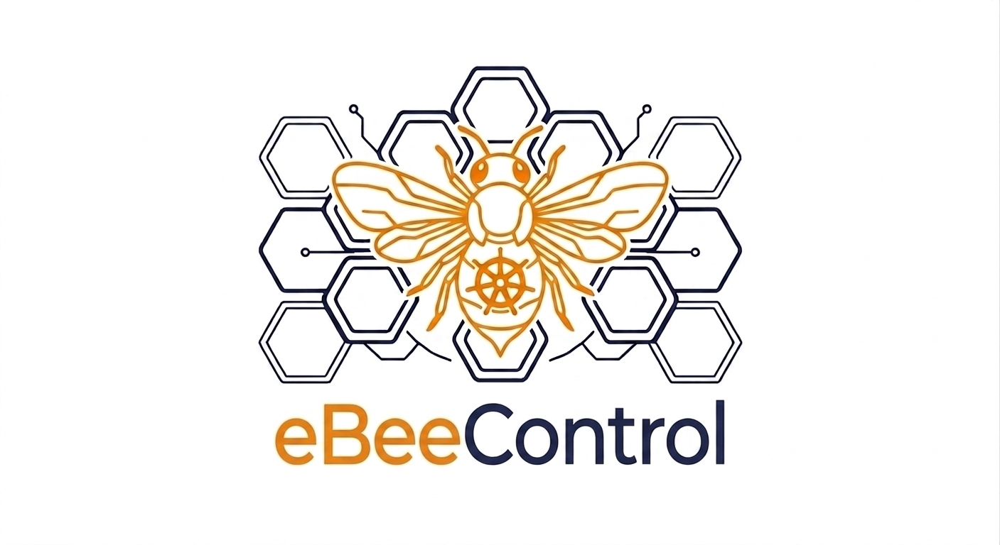

<p align="center">
  
</p>

<h1 align="center">eBeeControl</h1>

<p align="center">
  <strong>Autonomous Deception Engine for Kubernetes</strong>
</p>

<p align="center">
  A Gemini-powered agent that uses eBPF and adaptive learning to autonomously deploy, monitor, and respond to honeytoken access in Kubernetes environments.
</p>

---

## Overview

eBeeControl is an autonomous deception engine that combines kernel-level monitoring, intelligent decoy deployment, and machine learning to detect and contain attackers in Kubernetes clusters — without human intervention.

The system operates in a continuous loop: **discover** high-risk services → **deploy** honeytokens → **detect** access → **assess** threat → **respond** → **learn**. Every decision is made by a Gemini-powered agent that reasons about context, adapts its strategy over time, and reports everything to Dynatrace for full operational visibility.

## Objectives

- **Detect attackers early** — Place honeytokens where they're most likely to be accessed by unauthorized actors, using eBPF kernel-level monitoring that cannot be evaded by userspace techniques.

- **Respond autonomously** — Isolate compromised pods, block attacker IPs, and deploy additional traps within seconds of detection — no human approval required.

- **Learn and adapt** — Feed incident outcomes to Vertex AI so the placement model improves over time, reducing false positives and optimizing honeytoken positioning without manual policy updates.

- **Provide full visibility** — Push all operational data (events, responses, health, reports) to Dynatrace for a native dashboard experience using existing observability infrastructure.

- **Operate 24/7 without intervention** — Run the full detection-response-learning cycle continuously with health monitoring, graceful degradation, and automated recovery.

## Architecture

```
┌─────────────────────────────────────────────────────────────────┐
│                        eBeeControl Agent                         │
│                    (Gemini / Google Cloud Agent Builder)          │
├─────────────────────────────────────────────────────────────────┤
│  Discovery → Deployment → Detection → Assessment → Response     │
│                         → Reporting → Learning                   │
└────────┬──────────┬──────────┬──────────┬──────────┬────────────┘
         │          │          │          │          │
    ┌────▼────┐ ┌───▼───┐ ┌───▼────┐ ┌───▼───┐ ┌───▼────────┐
    │Dynatrace│ │ Koney │ │Tetragon│ │Vertex │ │ Kubernetes │
    │MCP Server│ │Deployer│ │Monitor │ │  AI   │ │    API     │
    └─────────┘ └───────┘ └────────┘ └───────┘ └────────────┘
```

## Core Components

| Component | Role |
|-----------|------|
| **Gemini Agent** | Orchestrates decisions — where to place traps, how to classify threats, what actions to take |
| **Tetragon (eBPF)** | Kernel-level file access monitoring — detects honeytoken access within 1 second |
| **Koney** | Deploys decoy secrets, files, and credentials into targeted pods |
| **Dynatrace MCP Server** | Provides service topology, Davis AI anomaly scores, and contextual intelligence |
| **Vertex AI** | Trains on attack patterns to improve future honeytoken placement |
| **Dynatrace Dashboard** | Native operational visibility via metrics and log ingestion APIs |

## Key Features

- **Threat Classification** — Classifies threats as low/medium/high/critical based on namespace, service criticality, and anomaly scores
- **Autonomous Response** — Pod isolation, IP blocking, and additional trap deployment based on threat level
- **Forensic Reports** — Gemini-generated incident reports with timelines and recommended follow-up actions
- **Model Publish Guard** — New placement models are only deployed if they meet or exceed current accuracy
- **Graceful Degradation** — Continues operating when individual components fail, with health monitoring and escalation alerts
- **24 Property-Based Tests** — Formal correctness guarantees validated with fast-check across all critical behaviors

## Quick Start

```bash
# Install dependencies
npm install

# Run all tests (703 tests across 54 files)
npm test

# Build
npm run build

# Start the agent
npm start
```

## Tech Stack

- **TypeScript** (strict mode) — Type-safe implementation across all components
- **Vitest** — Test runner with 703 passing tests
- **fast-check** — Property-based testing for 24 correctness properties
- **Google Cloud Agent Builder + Gemini** — AI-powered decision making
- **Cilium Tetragon** — eBPF-based kernel monitoring
- **Koney** — Kubernetes honeytoken deployment
- **Dynatrace** — Observability, context, and operational dashboard
- **Vertex AI** — Adaptive learning and model retraining

## Project Structure

```
src/
├── agent/           # Orchestrator, threat classifier, response planner, registry, audit log
├── tetragon/        # eBPF monitor, event buffer, event forwarder
├── koney/           # Honeytoken deployer
├── dynatrace/       # MCP Server client (discovery, context, events)
├── dynatrace-ingestion/  # Metrics/log clients, event broadcaster, view models
├── vertex/          # AI trainer (ingestion, retraining, publish guard)
├── types/           # Core interfaces and data models
├── utils/           # Retry utilities, service ranking
└── index.ts         # Application entry point

tests/
├── properties/      # 24 property-based tests (fast-check)
└── integration/     # End-to-end workflow tests
```

## License

Proprietary — All rights reserved.
